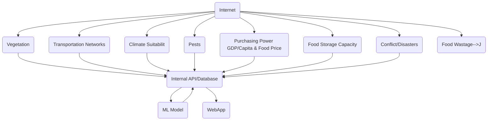

# Frontend needs

Need result of model

- Cords Data (Box)
  - lat float
  - long float

# ML

- Grocery

  - Cor Grid

- Conflict and disaster

For the model there are 8 input fields that different ML projects

- Vegetation
- Transportation Networks
- Climate Suitability
- Pests
- Purchasing Power (GDP/Capita & Food Price)
- Food Storage Capacity
- Conflict/Disasters
- Food Wastage

All of these are associated with a data src, each one of these is called from the files itself. To See examples of those go to `ml/data engineering/`.

When these functions run, the output is set to a database.

# DB Design
| Country Code | Bounding Box [ ] | Vegetation Score  | Vegetation Score | Transportation Networks | Climate Suitability Score | Soil Health Score | Purchasing Power | Food Storage | Conflict | Food Storage | Food Wastage | Food Scarcity Score |
| ------------ | ---------------- | -------------------- | ---------------- | ----------------------- | ------------------------- | ----------------- | ---------------- | ------------ | -------- | ------------ | ------------ | ------------------- |
| ...          | ...              | ...                  | ...              | ...                     | ...                       | ..                | ...              | ...          | ...      | ...          | ...          | ...                 |
|              |                  |                      |                  |                         |                           |                   |                  |              |          |              |              |                     |
